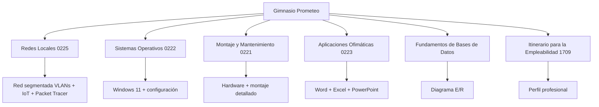

## Proyecto Intermodular SMR – Gimnasio PROMETEO
## Descripción del proyecto

Este proyecto consiste en el diseño e implementación de una infraestructura informática completa para un entorno empresarial simulado: un gimnasio denominado PROMETEO.

El objetivo principal es integrar los conocimientos adquiridos en los distintos módulos de 1º de SMR, desarrollando una solución realista, funcional y correctamente documentada.

## Descripción de la empresa

El gimnasio PROMETEO es un centro deportivo que gestiona:

Control de accesos mediante tornos automatizados
Gestión de clientes y usuarios
Monitorización mediante cámaras de seguridad
Sistema de sonido y dispositivos IoT

Cuenta con personal de recepción y administración, así como sistemas automatizados para mejorar la eficiencia del servicio.

## Infraestructura informática
Equipos principales
2 equipos en recepción
1 equipo en oficina administrativa

Todos los equipos utilizan Windows 11 como sistema operativo.

Otros dispositivos
4 tornos de acceso automatizados
Cámaras de videovigilancia
Sistema de altavoces
Dispositivos IoT para control del entorno
## Red y conectividad

La infraestructura está diseñada para permitir:

Comunicación entre equipos
Acceso a internet
Compartición de recursos
Integración con dispositivos IoT

Se ha definido un sistema de direccionamiento IP coherente y funcional.

## Módulos desarrollados
## Montaje y mantenimiento de equipos
Análisis de necesidades de hardware
Selección y configuración de componentes
Proceso de montaje de equipos
Plan de mantenimiento preventivo y correctivo
Inventario de equipos
## Sistemas Operativos
Instalación de Windows 11
Configuración inicial del sistema
Gestión de usuarios y permisos
Instalación de software necesario
Aplicación de medidas básicas de seguridad
## Redes Locales
Análisis de necesidades de red
Diseño de la topología de red
Plan de direccionamiento IP
Servicios de red básicos
Simulación de funcionamiento
## Aplicaciones Ofimáticas
Documento descriptivo de la empresa
Inventario de equipos (Excel)
Registro de incidencias (Excel)
Presentación del sistema
## Empleabilidad
Perfil profesional
Investigación del sector
Presentación del proyecto
Portfolio básico
Reflexión personal
## Objetivos del proyecto
Diseñar una infraestructura informática coherente
Aplicar conocimientos técnicos en un entorno realista
Documentar correctamente un sistema informático
Preparar una base para proyectos futuros
## Tecnologías utilizadas
Windows 11
Microsoft Word
Microsoft Excel
GitHub
Herramientas de diagramación
## 📂 Estructura del repositorio
/docs
 ├── ofimatica
 ├── montaje
 ├── redes
 ├── sistemas
 ├── empleabilidad
 └── bbdd
## Aprendizajes

Durante el desarrollo de este proyecto se han adquirido conocimientos en:

Planificación de sistemas informáticos
Instalación y configuración de equipos
Diseño de redes
Uso profesional de herramientas ofimáticas
Organización de proyectos en GitHub
## Conclusión

Este proyecto representa una simulación real del trabajo de un técnico en sistemas microinformáticos y redes, integrando múltiples áreas en una única solución funcional.

Ha permitido comprender cómo se conectan los distintos módulos del ciclo formativo y cómo se aplican en un entorno profesional.

## 🏗️ Estructura del repositorio

## Autor

Proyecto realizado por Cristian
Estudiante de Sistemas Microinformáticos y Redes (SMR)
